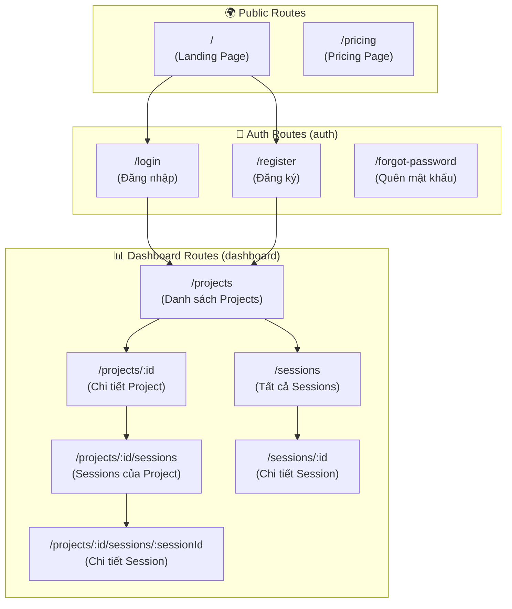
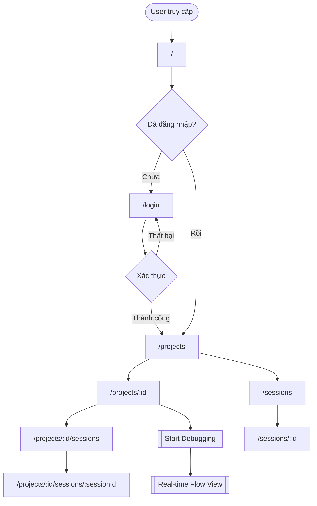

# 🛣️ VisualDebugger Frontend - Hướng dẫn Routing từ A-Z

Tài liệu này hướng dẫn chi tiết về hệ thống routing trong VisualDebugger Frontend, sử dụng **Next.js 14 App Router**.

---

## 📖 Mục lục

1. [Tổng quan cấu trúc routing](#-tổng-quan-cấu-trúc-routing)
2. [Route Map (Sơ đồ)](#-route-map-sơ-đồ)
3. [Chi tiết từng Route](#-chi-tiết-từng-route)
   - [Trang chủ (Landing Page)](#1-trang-chủ-landing-page)
   - [Authentication Routes](#2-authentication-routes)
   - [Dashboard Routes](#3-dashboard-routes)
4. [Layouts và Route Groups](#-layouts-và-route-groups)
5. [Dynamic Routes](#-dynamic-routes)
6. [Điều hướng (Navigation)](#-điều-hướng-navigation)
7. [Protected Routes](#-protected-routes)
8. [Error Handling](#-error-handling)

---

## 🌐 Tổng quan cấu trúc routing

VisualDebugger FE sử dụng **Next.js App Router** với cấu trúc folder-based routing:

```
app/
├── layout.tsx              # Root layout
├── page.tsx                # Landing page (/)
├── globals.css             # Global styles
├── loading.tsx             # Global loading state
├── error.tsx               # Global error boundary
├── not-found.tsx           # 404 page
│
├── (auth)/                 # 🔐 Auth route group
│   ├── layout.tsx          # Auth layout
│   ├── login/
│   │   └── page.tsx        # /login
│   ├── register/
│   │   └── page.tsx        # /register
│   └── forgot-password/    # /forgot-password
│
├── (dashboard)/            # 📊 Dashboard route group
│   ├── layout.tsx          # Dashboard layout (sidebar)
│   ├── projects/
│   │   ├── page.tsx        # /projects
│   │   └── [id]/
│   │       ├── page.tsx    # /projects/:id
│   │       └── sessions/
│   │           ├── page.tsx              # /projects/:id/sessions
│   │           └── [sessionId]/
│   │               └── page.tsx          # /projects/:id/sessions/:sessionId
│   └── sessions/
│       ├── page.tsx        # /sessions
│       └── [id]/
│           └── page.tsx    # /sessions/:id
│
└── pricing/                # /pricing
    └── page.tsx
```

---

## 🗺️ Route Map (Sơ đồ)



---

## 📄 Chi tiết từng Route

### 1. Trang chủ (Landing Page)

| URL | File | Mô tả |
|-----|------|-------|
| `/` | `app/page.tsx` | Trang giới thiệu VisualDebugger |

**Components sử dụng:**
- `LandingNavbar` - Navigation bar
- `Hero` - Hero section
- `Features` - Các tính năng
- `CodePreview` - Preview code
- `DashboardMockup` - Mockup dashboard
- `Statistics` - Thống kê
- `CallToAction` - CTA section
- `LandingFooter` - Footer

**Điều hướng từ đây:**
- 🔗 **Login** → `/login`
- 🔗 **Get Started** → `/register`

---

### 2. Authentication Routes

Tất cả routes trong group `(auth)` sử dụng chung `AuthLayout`:

| URL | File | Mô tả |
|-----|------|-------|
| `/login` | `app/(auth)/login/page.tsx` | Đăng nhập |
| `/register` | `app/(auth)/register/page.tsx` | Đăng ký tài khoản |
| `/forgot-password` | `app/(auth)/forgot-password/` | Quên mật khẩu |

#### 2.1. Login Page (`/login`)

```tsx
// Sử dụng component LoginForm
import { LoginForm } from '@/components/features/auth/LoginForm';

export default function LoginPage() {
    return <LoginForm />;
}
```

**Thao tác người dùng:**
1. Nhập email và password
2. Nhấn **Sign In**
3. Sau khi đăng nhập thành công → Redirect đến `/projects`

#### 2.2. Register Page (`/register`)

```tsx
// Sử dụng component RegisterForm
import { RegisterForm } from '@/components/features/auth/RegisterForm';

export default function RegisterPage() {
    return <RegisterForm />;
}
```

**Thao tác người dùng:**
1. Nhập thông tin: Email, Password, Confirm Password
2. Nhấn **Create Account**
3. Sau khi đăng ký thành công → Redirect đến `/login` hoặc `/projects`

---

### 3. Dashboard Routes

Tất cả routes trong group `(dashboard)` sử dụng `DashboardLayout` với **Sidebar** và **BottomNav** (mobile).

#### 3.1. Projects Page (`/projects`)

| URL | File | Mô tả |
|-----|------|-------|
| `/projects` | `app/(dashboard)/projects/page.tsx` | Danh sách tất cả projects |

**Tính năng:**
- 📊 **Stats Grid** - Thống kê: Total Events, Error Rate, Avg Latency, Active Sessions
- 🔍 **Search** - Tìm kiếm project theo tên
- ➕ **Create Project** - Tạo project mới (Dialog)
- 📈 **Trend Chart** - Biểu đồ Activity Trend
- 📋 **Project Cards** - Danh sách project cards
- 📜 **Activity Log** - Global Stream Activity

**Điều hướng:**
- Click vào **Project Card** → `/projects/:id`
- Click **Add Project** → Mở CreateProjectDialog

---

#### 3.2. Project Detail Page (`/projects/:id`)

| URL | File | Mô tả |
|-----|------|-------|
| `/projects/:id` | `app/(dashboard)/projects/[id]/page.tsx` | Chi tiết 1 project cụ thể |

**Thao tác:**
1. Truy cập từ `/projects` bằng cách click vào project card
2. `:id` = Project ID (UUID)

**Tính năng:**
- 📝 **Project Info** - Tên, mô tả, trạng thái
- 🔑 **API Key Section** - Hiển thị và copy API key
- 📊 **Stats** - Total Events, Error Rate, Avg Latency
- 📈 **Trend Chart** - Activity trend của project
- 📜 **Activity Log** - Recent activity của project
- ⚙️ **Settings** - Nút điều hướng đến settings
- ▶️ **Start Debugging** - Bắt đầu debug session

**URL Params:**
```tsx
const params = useParams();
const projectId = params.id as string; // UUID
```

---

#### 3.3. Project Sessions (`/projects/:id/sessions`)

| URL | File | Mô tả |
|-----|------|-------|
| `/projects/:id/sessions` | `app/(dashboard)/projects/[id]/sessions/page.tsx` | Danh sách sessions của project |

**URL Params:**
- `:id` = Project ID

---

#### 3.4. Session Detail (`/projects/:id/sessions/:sessionId`)

| URL | File | Mô tả |
|-----|------|-------|
| `/projects/:id/sessions/:sessionId` | `app/(dashboard)/projects/[id]/sessions/[sessionId]/page.tsx` | Chi tiết session |

**URL Params:**
- `:id` = Project ID
- `:sessionId` = Session ID

---

#### 3.5. All Sessions Page (`/sessions`)

| URL | File | Mô tả |
|-----|------|-------|
| `/sessions` | `app/(dashboard)/sessions/page.tsx` | Danh sách tất cả sessions |

---

#### 3.6. Session Detail Alternative (`/sessions/:id`)

| URL | File | Mô tả |
|-----|------|-------|
| `/sessions/:id` | `app/(dashboard)/sessions/[id]/page.tsx` | Chi tiết session (truy cập trực tiếp) |

**URL Params:**
```tsx
export default function SessionDetailPage({ params }: { params: { id: string } }) {
    const sessionId = params.id;
    // ...
}
```

---

## 🎨 Layouts và Route Groups

### Route Groups

Next.js sử dụng **Route Groups** với cú pháp `(groupName)` để tổ chức routes mà KHÔNG ảnh hưởng đến URL:

```
(auth)/login/page.tsx     → URL: /login     (KHÔNG phải /auth/login)
(dashboard)/projects/     → URL: /projects  (KHÔNG phải /dashboard/projects)
```

### Auth Layout

```tsx
// app/(auth)/layout.tsx
export default function AuthLayout({ children }) {
    return (
        <div className="dark">
            <BackgroundPattern />
            <AuthHeader />
            <main>{children}</main>
        </div>
    );
}
```

**Features:**
- Dark theme
- Background pattern animation
- Responsive (mobile header riêng)
- Auth card với gradient border

### Dashboard Layout

```tsx
// app/(dashboard)/layout.tsx
export default function DashboardLayout({ children }) {
    return (
        <div className="flex min-h-screen">
            <Sidebar />
            <div className="flex flex-col w-full">
                <main>{children}</main>
                <BottomNav /> {/* Mobile only */}
            </div>
        </div>
    );
}
```

**Features:**
- Fixed Sidebar (desktop)
- Bottom Navigation (mobile)
- Dark background theme
- Responsive padding

---

## 🔀 Dynamic Routes

Dynamic routes sử dụng cú pháp `[param]`:

### Cách đọc params

```tsx
'use client';
import { useParams } from 'next/navigation';

export default function ProjectDetailPage() {
    const params = useParams();
    const projectId = params.id as string;
    // ...
}
```

### Server Component

```tsx
// Server Component (không có 'use client')
export default function Page({ params }: { params: { id: string } }) {
    const projectId = params.id;
    // ...
}
```

### Nested Dynamic Routes

```
/projects/[id]/sessions/[sessionId]/page.tsx
```

Params:
```tsx
const params = useParams();
// params = { id: "project-uuid", sessionId: "session-uuid" }
```

---

## 🚀 Điều hướng (Navigation)

### Link Component

```tsx
import Link from 'next/link';

// Static route
<Link href="/projects">Projects</Link>

// Dynamic route
<Link href={`/projects/${project.id}`}>View Project</Link>
```

### useRouter Hook

```tsx
'use client';
import { useRouter } from 'next/navigation';

export default function SomePage() {
    const router = useRouter();
    
    const handleClick = () => {
        router.push('/projects');          // Navigate
        router.replace('/login');          // Replace (no history)
        router.back();                     // Go back
        router.refresh();                  // Refresh current route
    };
}
```

### Programmatic Navigation

```tsx
// Sau khi submit form thành công
const handleSuccess = () => {
    router.push(`/projects/${newProjectId}`);
};
```

---

## 🔒 Protected Routes

### Cách kiểm tra Authentication

```tsx
'use client';
import { useAuth } from '@/hooks/useAuth';
import { useRouter } from 'next/navigation';
import { useEffect } from 'react';

export default function ProtectedPage() {
    const { user, isLoading } = useAuth();
    const router = useRouter();
    
    useEffect(() => {
        if (!isLoading && !user) {
            router.replace('/login');
        }
    }, [user, isLoading, router]);
    
    if (isLoading) return <Loading />;
    if (!user) return null;
    
    return <div>Protected Content</div>;
}
```

### Protected Routes trong dự án

Tất cả routes trong `(dashboard)` đều yêu cầu authentication:
- `/projects`
- `/projects/:id`
- `/sessions`
- `/sessions/:id`

---

## ⚠️ Error Handling

### Global Error Boundary

```tsx
// app/error.tsx
'use client';

export default function Error({
    error,
    reset,
}: {
    error: Error;
    reset: () => void;
}) {
    return (
        <div>
            <h2>Something went wrong!</h2>
            <button onClick={reset}>Try again</button>
        </div>
    );
}
```

### 404 Not Found

```tsx
// app/not-found.tsx
export default function NotFound() {
    return (
        <div>
            <h2>Page Not Found</h2>
            <Link href="/">Return Home</Link>
        </div>
    );
}
```

### Loading States

```tsx
// app/(dashboard)/projects/loading.tsx
export default function Loading() {
    return <ProjectCardSkeleton />;
}
```

---

## 📋 Quick Reference

| URL | File Path | Description |
|-----|-----------|-------------|
| `/` | `app/page.tsx` | Landing page |
| `/login` | `app/(auth)/login/page.tsx` | Đăng nhập |
| `/register` | `app/(auth)/register/page.tsx` | Đăng ký |
| `/forgot-password` | `app/(auth)/forgot-password/` | Quên mật khẩu |
| `/projects` | `app/(dashboard)/projects/page.tsx` | Danh sách projects |
| `/projects/:id` | `app/(dashboard)/projects/[id]/page.tsx` | Chi tiết project |
| `/projects/:id/sessions` | `app/(dashboard)/projects/[id]/sessions/page.tsx` | Sessions của project |
| `/projects/:id/sessions/:sessionId` | `app/(dashboard)/projects/[id]/sessions/[sessionId]/page.tsx` | Chi tiết session |
| `/sessions` | `app/(dashboard)/sessions/page.tsx` | Tất cả sessions |
| `/sessions/:id` | `app/(dashboard)/sessions/[id]/page.tsx` | Chi tiết session |
| `/pricing` | `app/pricing/page.tsx` | Trang pricing |

---

## 🎯 User Flow (Luồng người dùng)



---

## 🔧 Thêm Route Mới

1. **Tạo folder** trong `app/`:
   ```
   app/new-route/page.tsx
   ```

2. **Thêm page component**:
   ```tsx
   export default function NewRoutePage() {
       return <div>New Route</div>;
   }
   ```

3. **Thêm loading state** (optional):
   ```tsx
   // app/new-route/loading.tsx
   export default function Loading() {
       return <Skeleton />;
   }
   ```

4. **Thêm vào navigation**:
   - Cập nhật `Sidebar.tsx`
   - Cập nhật `BottomNav.tsx` (mobile)

---

*Tài liệu được cập nhật: 29/12/2024*
